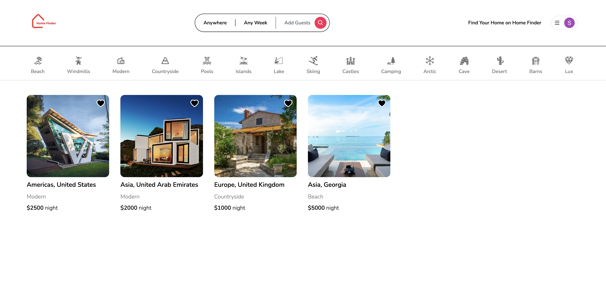
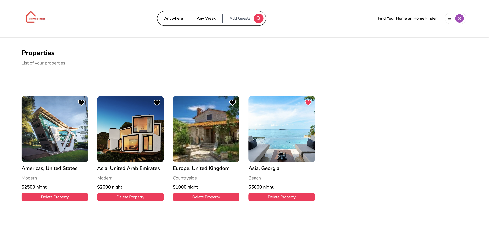
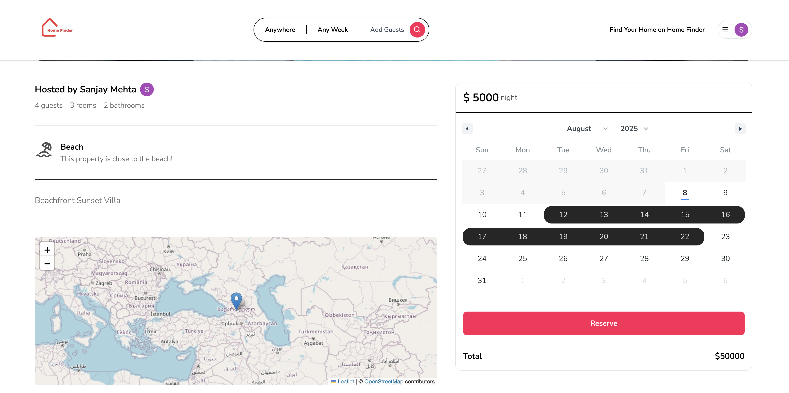

# 🏡 Home Finder

A **Full Stack** real estate marketplace inspired by Airbnb, built with **Next.js 13 App Router**, **React**, **Tailwind CSS**, **Prisma**, **MongoDB**, and **NextAuth**.  
This application allows users to list properties, search for rentals, manage bookings, and handle authentication seamlessly.

---

## 🚀 Features

- **Property Listings** – Create, view, and manage properties.
- **Advanced Search & Filters** – Location-based search, date filters, and category browsing.
- **User Authentication** – Secure login & registration with NextAuth.
- **Image Uploads** – Cloud storage for listing images.
- **Reservation System** – Book properties with real-time availability.
- **Responsive UI** – Mobile-first design with Tailwind CSS.
- **Modern App Router** – Using Next.js 13's new App Router for improved routing and layouts.

---

## Tech Stack

| Category        | Technology |
|-----------------|------------|
| **Frontend**    | Next.js 13 (App Router), React 18, Tailwind CSS |
| **Backend**     | Next.js API Routes, Prisma ORM |
| **Database**    | MongoDB (via Prisma) |
| **Auth**        | NextAuth.js |
| **File Storage**| Cloudinary (for image uploads) |
| **Deployment**  | Vercel |

---

## 📸 Screenshots

Below are some previews of **Home Finder** in action:

| Home Page | Property Page | Booking Page |
|-----------|--------------|--------------|
|  |  |  |


---

## ⚡ Getting Started

### 1️⃣ Clone the repository
```bash
git clone https://github.com/yourusername/home-finder.git
cd home-finder
```

### 2️⃣ Install dependencies
```bash
npm install
```

### 3️⃣ Configure environment variables

Create a .env file in the root and add:
```env
DATABASE_URL="your_mongodb_connection_string"
NEXTAUTH_SECRET="your_nextauth_secret"
GITHUB_ID="your_github_oauth_id"
GITHUB_SECRET="your_github_oauth_secret"
GOOGLE_CLIENT_ID="your_google_client_id"
GOOGLE_CLIENT_SECRET="your_google_client_secret"
NEXT_PUBLIC_CLOUDINARY_CLOUD_NAME="your_cloud_name"
```

### 4️⃣ Set up the database
```bash
npx prisma db push
```

### 5️⃣ Run the app
```bash
npm run dev
```
App will be available at: http://localhost:3000


### 🌐 Deployment

#### Deploy to Vercel:
##### 1. Push your project to GitHub.
##### 2. Import into Vercel.
##### 3. Add environment variables in the Vercel dashboard.
##### 4. Deploy.

### 🧑‍💻 Author

##### GitHub: [zsanjay](https://github.com/zsanjay)
##### LinkedIn: https://www.linkedin.com/zsanjay
